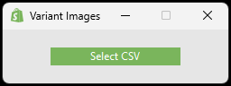

# Shopify-Variant-Image-Scanner
A lightweight Python desktop utility that scans a Shopify product CSV export and identifies products with missing variant images.
Upload your Shopify CSV, run the check, and export a clean list of affected product handles.

## Demo Screenshots
<div style="display: flex;">
  
</div>

## Features
- **Detect Missing Variant Images** — find colour variants with empty `Variant Image` fields.
- **Active Product Filtering** — only checks products marked as `active`.
- **Colour Variant Filtering** — only processes products where `Option1 Name` is `color` or `Colour`.
- **SKU Filtering** — ignores variants with blank SKUs.
- **Clean CSV Export** — outputs a simple list of product handles to review.
- **Simple GUI** — built with Tkinter for fast usage.

## How It Works
1. **Export Products from Shopify** — download your product list from Shopify as a `.csv` file (Products → Export).
2. **Load the CSV into the app** — click **Select CSV** and choose your exported file.
3. **Save Results** — the app processes the file and prompts you to save a new `.csv` containing the affected product handles. 

## Tech Stack
- **Python**
- **Tkinter** — GUI framework for dashboard.
- **pandas** — CSV parsing and filtering.

## Installation
1. **Clone the Repository** — Clone the project to your local machine.
2. **Install Dependencies** — Run ```pip install -r requirements.txt``` to install all required packages.
3. **Launch Application** — Run ```py app.py``` to start the application.

## Usage
- **Load CSV** — click **Select CSV** and choose your Shopify product export.
- **Process data** — the app scans for variants missing images and prepares a clean results list.
- **Save output** — export the results to a new CSV for review.

## Future Improvements
- **Drag-and-drop CSV** — load files by dropping them onto the window.
- **Additional column exports** — include more product details in the output CSV.